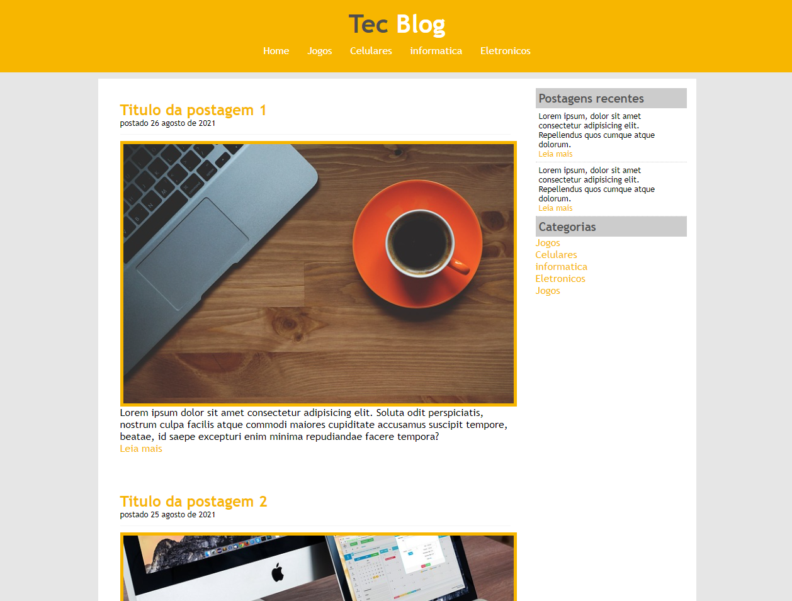
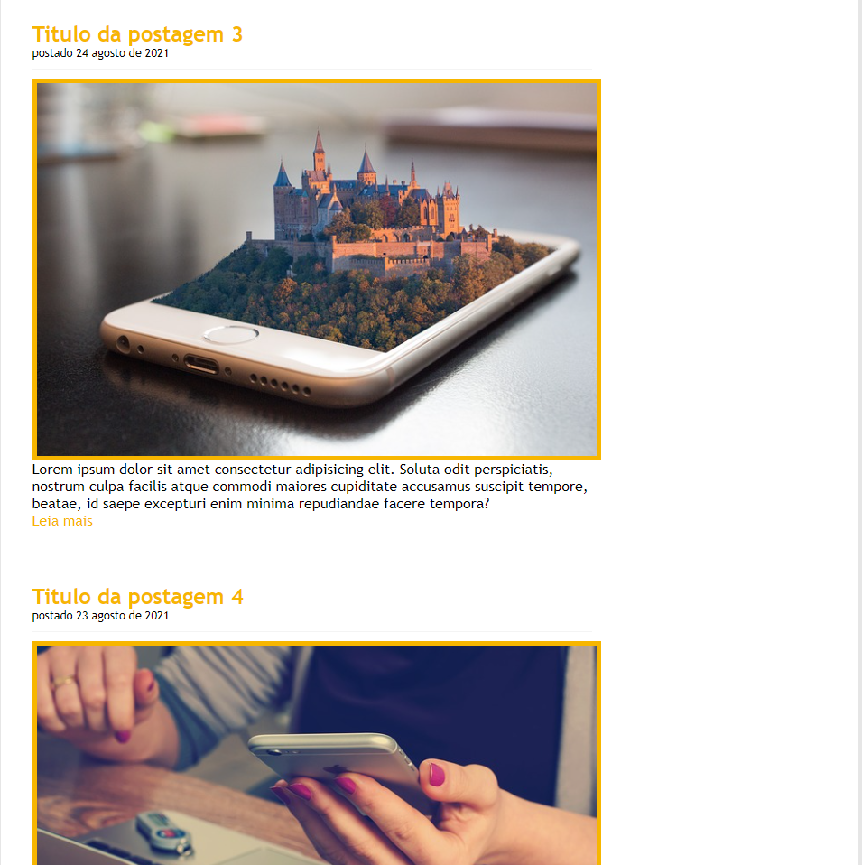

# Site TecBlog
## Site voltado a apresetação de uma página principal de um blog de tecnologia, onde apresenta o escopo da página que segue o padrão ultilizado pelos blogs atuais.
<h1 align="center">
  
</h1>

 <a href="#sobre-o-projeto">Sobre</a> •
 <a href="#funcionalidades">Funcionalidades</a> •
 <a href="#layout">Layout</a> • 
 <a href="#tecnologias">Tecnologias</a> • 

<h4 align="center"> 
	 TecBlog 💻 Finalizado
</h4>

## 💻Sobre o projeto

💻 TecBlog foi um projeto desenvolvido durante o curso de Desenvolvimento Web ministrado pelo professor Jamilton Damasceno.

Esse projeto foi desenvolvido para o estudo de implementação de conceitos básicos e boas práticas adotados na criação de páginas web abordado diversos temas como posicionameto estático e relativo, listas, navegação, sobreposição de elementos, formtação de links...
---

## ⚙Funcionalidades

-Basicamente o projeto consiste de apenas uma páginas principal pois o fim é apenas didático e introdutório no html e css, sendo essa página o index:

  Página Index:
  
  Nesta página esta localizado as informações principais referente ao Blog, com uma barra de navegação, seguido de uma barra de navegação lateral e no centro o conteúdo do blog, povoado de artigos criados com links personalizados.
  
  
  
  
  ---

## 🎨Layout

O layout foi fornecido pelo professor 
[Jamilton Damasceno](https://www.linkedin.com/in/jamiltondamasceno/).

### 🛠Tecnologias

As seguintes ferramentas foram usadas na construção do projeto:

- [HTML](https://www.w3schools.com/html/default.asp)
- [CSS](https://www.w3schools.com/css/)
- [VisualStudio](https://visualstudio.microsoft.com/pt-br/)

